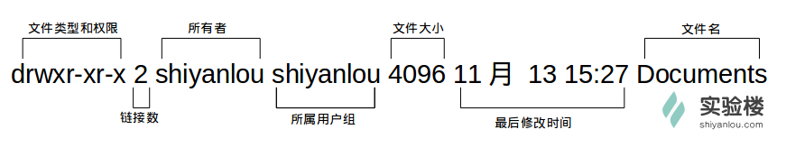
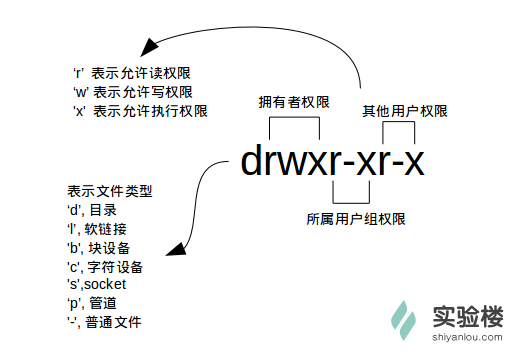
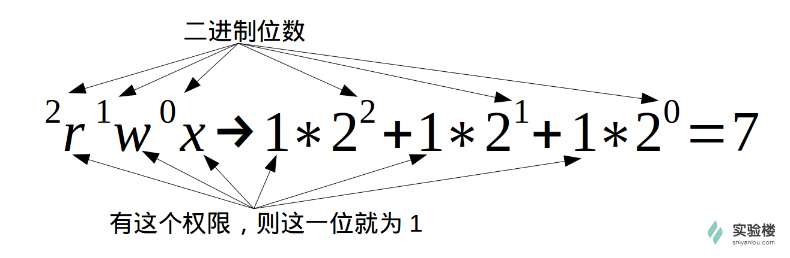

## 常用通配符

`*`: 匹配0或多个字符
`?`: 匹配任意一个字符
`[list]`: 匹配list中的任意单一字符
`[!list]`: 匹配除了list中的单一字符意外的字符
`[c1-c2]`: 匹配c1-c2中的任意单一字符
`{string1,string2,...}`: 匹配string1或string2(或更多)其一字符
`{c1..c2}`: 匹配c1-c2全部字符

## 用户及文件权限管理

**查看用户**: `who am i` OR `who mom likes`
**切换用户**:
  * `su <user>`,
  * `su - <user>`同时环境变量也会改变成目标用户的环境变量
**新建用户**: `sudo adduser <user>`
**查看用户所属的用户组**:
  * `groups <user>`
  * 查看`/etc/group`文件

**将用户加入sudo用户组**: `sudo usermod -G sudo <user>`
**删除用户**: `sudo deluser <user> --remove-home`

**文件权限**:

**注意**: 一个目录必须同时具有读权限和执行权限才可以打开并查看内部文件，而一个目录要有写权限才可以在其中创建其他文件，这是因为目录文件实际保存的是该目录里面的文件的列表等信息

**更改文件所有者**: `sudo chown <user> <file>`

**修改文件权限**:
  * **二进制数字表示**
    * 
    * eg: `chomd 700 iphone6` 权限修改为只有自己可以读写执行

  * **加减赋值操作**
    * `g` `o` `u`分别表示group、others和user，`+` `-`分别表示增加或减去相应的权限
    * eg: `chmod go-rw iphone6`

**`adduser`和`useradd`的区别**: `useradd`只创建用户，创建完用`passwd <user>`设置用户，而`adduser`会创建用户并同时设置其他相关参数。其实`useradd` `userdel`更像一种命令，执行完就返回。而`adduser` `deluser`更像一种程序，需要你输入确定一系列操作

## 文件的基本操作

**新建一个空白文件**: `touch <file>`
**新建一个目录**:
  * `mkdir <dir>`
  * `mkdir -p /parent/son/grandson`加上`-p`参数同时创建父目录
  * **参数**:
    * `-m`(--mode): 设定权限<模式>
    * `-p`(--parents): 设定一系列目录
    * `-v`(--verbose): 每次创建新目录都显示信息

**复制文件**:
  * `cp <file> <dir>`
  * `cp -r <dir> <dir>` 加上`-r`或`-R`表示递归复制，需要在复制目录的时候加上

**删除文件**:
  * `rm <file>`
  * 有时想删除一些为只读权限的文件，直接用上面的命令会有提示，这时可以用`rm -f <file>`来忽略这些提示
  * 删除目录，要加上`-r`或`-R`参数
  * **参数**:
    * `-f`(--force): 忽略不存在的文件，从不给出提示
    * `-i`(--interactive): 进行交互式删除
    * `-r`(--recursive): 指示rm将参数中列出的全部目录和子目录递归的删除
    * `-v`(--verbose): 详细显示进行的步骤
**移动文件与重命名**:
  * 移动: `mv <file> <dir>`
  * 重命名: `mv <old> <new>`
  * 批量重命名:
    * `touch file{1..5}.txt`
    * `rename 's/\.txt/\.c/' *.txt`
    * `rename 'y/a-z/A-Z/' *.c`

**查看文件**:
  * `cat <file>`: 正序显示，加上`-n`显示行号
  * `tac <file>`: 倒序显示
  * `nl`: 添加行号并显示，比`cat -n`更专业
    * `-b`
      * `-b a`: 显示全部行号
      * `-b t`:只显示非空格行的行号
    * `-n`
      * `-n ln`: **行号字段**左侧显示行号
      * `-n rn`: **行号字段**行号字段侧显示行号且不加0
      * `-n rz`: **行号字段**侧显示，且加0
    * `-w`: 行号字段占用的位数，默认为6
  * `more <file>`: `enter`键向下滚动一行，`space`键向下滚动一屏，`h`显示帮助，`q`退出
  * `less <file>`:
  * `head <file>`: 查看文件头几行，默认为10，加上`-n`参数指定查看几行
  * `tail <file>`: 查看文件末尾几行，默认为10；加上`-n`参数指定查看几行；`-f`可以不停的读取文件内容并输出，达到实时监控的目的

**查看文件类型**: `file <file>`

**编辑文件**: `vim <file>`

**比较文件的不同**: `vimdiff <file1> <file2> ...`

## 环境变量与文件查找

**声明变量**: `declare tmp`: 也可以不用declare声明
**环境变量**:
  `set`: 显示当前shell所有变量，包括其内建变量，用户自定义变量以及导出的环境变量
  `env`: 显示当前用户相关的环境变量
  `export`: 显示从shell中导出成环境变量的变量，也可以通过它将自定义变量导出为环境变量

我们在当前shell声明一个变量例如`tmp=helloworld`
  * 目前只能在当前shell环境使用，切换到别的shell环境无法使用，这时使用`export tmp`导出tmp为环境变量就可以在不同的shell环境下使用了
  * 但当我们关机或者关闭当前shell后环境变量就没有了。按变量的生存周期划分，linux变量分为永久的(需要修改配置文件，永久生效)、临时的(export即可，关闭shell时失效)。有两个重要文件`/etc/bashrc`、`/etc/profile`分别存放shell变量和环境变量，每个用户目录下也有一个隐藏文件`.profile`这个存放的是当前用户的环境变量，而`/etc/profile`存放的是所有用户的，所以如果想添加一个永久生效的环境变量，只需把他加入`/etc/profile`即可

我们在shell中输入一个命名，shell会按照PATH储存的路径依次去寻找可执行文件，有同名的执行先找到的。

**为文件添加可执行权限**: `chmod 755 hello_shell.sh`
**gcc生成可执行文件**: `gcc -o hello_shell hello_shell.c`
我们自己写的可执行文件只能在其所在的目录执行，或者指定其目录进行执行，很不方便。我们可以`PATH=$PATH:/yourDir`来把可执行文件的目录添加到PATH中。但我们关掉终端就会失效。每个用户的home目录中有一个配置文件，shell每次启动时候都会默认执行它来初始化环境等操作。zsh的为`zshrc`，bash的为`bashrc`。他们在`etc`下也还有一个或多个的全局的配置文件，但我们一般只修改用户目录下的配置文件。`echo "PATH=$PATH:/home/shiyanlou/mybin" >> .zshrc`这样你写的可执行文件也可以随时使用了

**修改和删除已有变量**:
`${变量名#匹配子串}`: 从头向后开始匹配，删除符合匹配字串的最短数据
`${变量名##匹配子串}`: 从头向后开始匹配，删除符合匹配字串的最长数据
`${变量名%匹配子串}`: 从尾向前开始匹配，删除符合匹配字串的最短数据
`${变量名%%匹配子串}`: 从尾向前开始匹配，删除符合匹配字串的最长数据
`${变量名/旧的字串/新的字串}`: 将符合要求的第一个字串替换为新的字串
`${变量名//旧的字串/新的字串}`: 将符合旧字串的全部字串替换为新的字串

**删除环境变量**: `unset 变量名`

我们在修改配置脚本后不会立即生效，可以使用`source file`来让其立即生效，source有个别名.，所以也可以这样写`. file`

## 搜索文件

`whereis`:
  * 简单快速，直接从数据库进行查询。
  * 只能搜索三种文件
    * 1.二进制文件(-b)
    * 2.man帮助文件(-m)
    * 3.源码文件(-s)

`locate`:
  * 快而全，通过`/var/lib/mlocate/mlocate.db`数据库进行查找，不过这个数据库不是实时更新的，系统会使用定时任务每天自动执行`updatedb`更新一次，所以有时候刚添加的文件可能会找不到，需要手动执行一次`updatedb`
  * 用来查找指定目录下的不同文件类型
  * eg:
    * `locate /etc/sh`: 搜索.etc下所有以sh开头的文件，不止在/etc目录下查找，还会自动递归子目录进行查找
    * `locate /usr/share/\*.jpg`: 搜索/usr/share/下所有jpg文件
  * 如果只是统计数目的话，加上`-c`参数，`-i`忽略大小写

`which`:
  * 小而精，它只从PATH环境变量指定的路径去搜索命令，通常用来确认是否安装了指定的软件
  * eg: `which man`

`find`:
  * 精而细，非常强大，可以通过文件类型，文件名还有文件属性权限等进行查找
  * eg: `sudo find /etc/ -name interfaces` 在/etc/目录下搜索名字为interfaces的文件
  * 与时间相关的命令参数:
    * `-atime`: 最后访问时间
    * `-ctime`: 创建时间
    * `-mtime`: 最后修改时间
      * `-mtime n`: 在n天之前的'一天之内'修改过的文件
      * `-mtime +n`: 在n天之前(不包含n天)被修改过的文件
      * `-mtime -n`: 在n天之内(包含n天)被修改的文件
      * `newer file`: 列出比file还要新的文件
      * eg:
        * `find ~ -mtime 0` 列出home目录下，当天有改动的文件
        * `find ~ newer /home/shiyanlou/Code`: 列出家目录下比Code文件夹新的文件

## 文件打包与压缩

**打包和压缩的区别**: 打包是指将一大堆文件或目录什么的变成一个总的文件，压缩则是将一个大的文件通过一些压缩算法变成一个小文件。为什么要区分这两个概念呢？其实这源于Linux中的很多压缩程序只能针对一个文件进行压缩，这样当你想要压缩一大堆文件时，你就得先借助另外的工具将这一大堆文件先打 成一个包，然后再就原来的压缩程序进行压缩

**压缩文件类型说明**:
`*.zip`: zip程序打包压缩的文件
`*.rar`: rar程序压缩的文件
`*.7z`: 7zip程序压缩的文件
`*.tar`: tar程序打包，未压缩的文件
`*.gz`: gzip程序压缩的文件
`*.xz`: xz程序压缩的文件
`*.bz2`: bzip2程序压缩的文件
`*.tar.gz`: tar打包，gzip压缩的文件
`*.tar.xz`: tar打包，xz程序压缩的文件
`*.tar.bz2`: tar打包，bzip2程序压缩的文件
`*.tar.7z`: tar打包，7z程序压缩的文件

**zip**:
eg:
  * `zip -r -q -o shiyanlou.zip /home/shiyanlou`:
    * 将shiyanlou的home目录打包成一个文件
    * `-r`表示递归打包包含子目录的全部内容
    * `-q`表示安静模式
    * `-o`表示输出文件需在其后紧跟打包输出文件名
  * `zip -r -9 -q -o shiyanlou._9.zip /home/shiyanlou -x ~/*.zip`:
    * `-9`--`-1`表示压缩级别，1表示最快压缩但体积大，9表示最慢但体积小
    * `-x`为了排除目录下的zip文件，只能使用绝对路径
    * 加上`-e`可以创建加密压缩包
    * 加上`-l`参数将LF(Line-Feed: linux下的换行符)转换为CR+LF(Carriage-Return+Line-Feed: window下的换行符)

**unzip**:
eg:
  * `unzip shiyanlou.zip`: 将shiyanlou.zip解压到当前目录
  * `unzip -q shiyanlou.zip -d ziptest`: 使用安静模式，将文件解压到指定目录
  * `unzip -l shiyanlou.zip`: 不解压，直接查看压缩包内容
  * `unzip -O GBK 中文压缩文件.zip`: linux上面默认使用UTF-8编码，有可能出现中文乱码问题，用`-O`指定编码来解决

**rar**:
eg:
  * `rar a shiyanlou.rar .`: 使用`a`参数添加一个目录`~`到一个归档文件，**注意**rar命令参数没有`-`,加上会报错
  * `rar d shiyanlou.rar .zshrc`: 指定压缩包删除某个文件
  * `rar l shiyanlou.rar`: 不解压，直接查看内容

**unrar**:
eg:
  * `unrar x shiyanlou.rar`: 全路径解压
  * `unrar e shiyanlou.rar tmp/`:去掉路径解压

**tar**:
eg:
  * `tar -cf shiyanlou.tar ~`:
    * 创建一个tar包
    * `-c`表示创建一个tar包
    * `-f`用于指定创建的文件名，必须紧跟在`-f`后面
    * `-v`以可视的方式输出打包文件
    * 上面的命令会自动去掉表示绝对路径的`/`,可以使用`-P`保留绝对路径符
  * `tar -xf shiyanlou.tar -C tardir`: 解包一个文件(`-x`参数)到指定路径的**已存在**目录(`-C`参数)
  * `tar -tf shiyanlou.tar`: 只查看，不解包(`-t`参数)
  * `tar -czf shiyanlou.tar.gz ~`:
    * 在创建tar文件的基础上添加`-z`参数，使用gzip来压缩文件。`-z`(*.tar.gz);`-J(*.tar.xz)`;`-j`(*.tar.bz2)
  * `tar -cxf shiyanlou.tar.gz`: 解压文件(`-x`参数)

**常用命令组合**:
  * `zip`:
    * 打包: `zip something.zip something`(目录应该加`-r`参数)
    * 解包: `unzip something`
    * 指定目录: `-d`参数

  * `tar`:
    * 打包: `tar -zcvf something.tar something`
    * 解包: `tar -zxvf something.tar`
    * 指定目录: `-C`参数

## 文件系统操作与磁盘管理

**df**(report filr system disk space usage): 查看磁盘容量
**du**(estimate file space usage): 查看目录容量
  * `-h`(human-readable): 人类易读的方式
  * `-d`: 目录深度
  * `-s`(summarize): 仅显示总计，只列出最后加总的值

**dd**:
  * 用来转换和复制文件。命令行格式为`选项=值`
  * `dd if=/dev/stdin of=test bs=10 count=1`:
    * `-if`(input file): 输入文件
    * `-of`(output file): 输出文件
    * `-bs`(blocks size): 块大小，默认为Byte，可以指定为K，M，G等
    * `-count`: 块的数量
  * `dd if=test of=TEST bs=5 count=1 conv=ucase`: `-conv`转换函数
  * `dd if=/dev/zero of=virtual.img bs=1M count=256`: 创建一个容量为256M的空文件

**黑底百分号表示这里没有换行符**

**mkfs**: `sudo mkfs.ext4 virtual.img`: 格式化磁盘
**mount**:
  * `sudo mount`: 查看以挂载的文件系统
  * `mount -o loop -t ext4 virtual.img /mnt`: 将虚拟磁盘镜像挂载到/mnt目录

**unmount**: `sudo unmount /mnt`: 卸载以挂载磁盘
**fdisk**:
  * `sudo fdisk -l`: 查看磁盘分区表信息
  * `sudo fdisk virtual.img`: 进入磁盘分区模式

## 帮助命令

**内建命令与外部命令的区别**:
  * 内建命令实际上是 shell 程序的一部分，其中包含的是一些比较简单的 Linux 系统命令，这些命令是写在bash源码的builtins里面的，并由 shell 程序识别并在 shell 程序内部完成运行，通常在 Linux 系统加载运行时 shell 就被加载并驻留在系统内存中。而且解析内部命令 shell 不需要创建子进程，因此其执行速度比外部命令快。比如：history、cd、exit 等等。
  * 外部命令是 Linux 系统中的实用程序部分，因为实用程序的功能通常都比较强大，所以其包含的程序量也会很大，在系统加载时并不随系统一起被加载到内存中，而是在需要时才将其调用内存。虽然其不包含在 shell 中，但是其命令执行过程是由 shell 程序控制的。外部命令是在 Bash 之外额外安装的，通常放在/bin，/usr/bin，/sbin，/usr/sbin等等。比如：ls、vi等。
  * 用`type`命令来查看命令的类型

**帮助命令**:
  * `help`: 用于显示shell**内建命令**的简要帮助信息。对于外部命令，命令本身会有一个`--help`参数用来查看帮助
  * `man`: 内容比`help`详细得多
  * `info`: 信息比`man`更详细

## 任务计划crontab

**命令格式**:
\# Example of job definition:
\# .---------------- minute (0 - 59)
\# |  .------------- hour (0 - 23)
\# |  |  .---------- day of month (1 - 31)
\# |  |  |  .------- month (1 - 12) OR jan,feb,mar,apr ...
\# |  |  |  |  .---- day of week (0 - 6) (Sunday=0 or 7) OR sun,mon,tue,wed,thu,fri,sat
\# |  |  |  |  |
\# *  *  *  *  * user-name command to be executed

`sudo service rsyslog start`: 启动rsyslog，以便我们可以通过日志中的信息来了解任务是否真的执行了
`sudo cron -f &`: 启动crontab服务，`&`放在命令参数后面表示该命令在后台运行
`crontab -e`: 添加计划任务
`*/1 * * * * touch /home/shiyanlou/$(date +\%Y\%m\%d\%H\%M\%S)`: 添加任务命令

**注意**: `%`在 crontab 文件中，有结束命令行、换行、重定向的作用，前面加`\`符号转义，否则，`%`符号将执行其结束命令行或者换行的作用，并且其后的内容会被做为标准输入发送给前面的命令。
`crontab -l`: 查看添加了那些任务
`crontab -r`: 删除任务

如果是系统级别的任务，只需要编辑`/etc/crontab`文件就可以
cron服务检测时间最小单位是分钟，所以cron每分钟去读取一次`/etc/crontab`与`/var/spool/cron/crontabs`里面的内容

## 命令执行顺序控制与管道

**顺序执行多条命令**: eg: `sudo apt install update; sudo apt install some-tool; some-tool`
**有选择的执行命令**:
  * eg:
    * `which cowsay>/dev/null && cowsay -f head-in ohch~`
    * `which cowsay>/dev/null && echo "exist" || echo "not exist"`

**cut**:
  * `cut /etc/passwd -d ':' -f 1,6`: 打印`/etc/passwd`文件中以`:`为分隔符的第一字段和第六字段
  * 打印`/etc/passwd`文件中每一行的前N个字符
    * `cut /etc/passwd -c -5`: 前五个(包含第五个)
    * `cut /etc/passwd -c 5-`: 前五个之后的(包含第五个)
    * `cut /etc/passwd -c 5`: 第五个
    * `cut /etc/passwd -c 2-5`: 2到5之间的(包含第五个)

**grep**:
  * `grep -rnI "shiyanlou" ~`:
    * `-r`: 表示递归搜索子目录的文件
    * `-n`: 表示打印匹配项行号
    * `-I`: 表示忽略二进制文件

**wc**: 用于统计一个文件中行，单词和字节的数目
  * `wc /etc/passwd`: 输出`/etc/passwd`文件的统计信息
    * `-l`: 行数
    * `-w`: 单词数
    * `-c`: 字节数
    * `-m`: 字符数
    * `-L`: 最长行字节数

**sort**: 将输入按照一定方式排序，然后再输出，支持的排序有字典排序(默认)、按月份排序、随即排序、反转排序、指定字段进行排序等等
  * `cat /etc/passwd | sort`: 字典排序
  * `cat /etc/passwd | sort -r`: 反转排序
  * `cat /etc/passwd | sort -t':' -k 3`:
    * `-t`用来指定字段的分隔符
    * `-k 字段号`指定对哪个字段进行排序

**uniq**: 用于过滤或输出重复行(只能去除连续重复的行)
  * `history | cut -c 8- | cut -d ' ' -f 1 | uniq`: 输出执行命令的那一列
  * `history | cut -c 8- | cut -d ' ' -f 1 | sort | uniq`: 输出执行命令的那一列(没有重复的)
  * `history | cut -c 8- | cut -d ' ' -f 1 | uniq -dc`: 输出重复过的行和重复次数
  * `history | cut -c 8- | cut -d ' ' -f 1 | uniq -D`: 输出所有重复的行

## 简单的文本处理

**tr**:
  * `tr [option]...SET1 [SET2]`
    * `-d`: 删除和set1匹配的字符，感觉向正则表达式`[set1]`一样
    * `-s`: 去除set1指定的在输入文本中连续并重复的字符(去连续重只剩一个？)
  * eg:
    * `echo "helo shiyanlou" | tr -d 'olh'`
    * `echo 'hello' | tr -s 'l'`
    * `cat /etc/passwd | tr '[:lower:]' '[:upper:]'`: 将所有小写转换为大写，也可以简单的写成`'[a-z]'` `'[A-Z]'`

**col**:
  * 将`Tab`转换成等数量的空格键，或者翻转这个操作
    * `-x`: 将`Tab`转换为空格
    * `-h`: 将空格转换为`Tab`(默认选项)
  * eg:
    * `cat -A /etc/protocols`: 查看/etc/protocols中的不可见字符，可以看到很多^I，这是tab转义成可见字符的符号
    * `cat /etc/protocols | col -x | cat -A`: 经过`col`转换后看不见^I了

**join**:
  * 将两个文件中包含相同内容的那一行合并在一起，我想是根据分隔符(默认为空格),比对指定字段(默认为第一字段),若比对字段相同则将比对字段放到合并后的行头，后面一次跟着对应文件的剩余部分
    * `-t`: 指定分隔符，默认为空格
    * `-i`: 忽略大小写
    * `-1`: 指明第一个文件的比对字段，默认为第一字段
    * `-2`: 指明第二个文件的比对字段，默认为第一字段
  * eg:
    * `sudo join -t ':' /etc/passwd /etc/shadow`
    * `sudo join -t ':' -1 4 /etc/passwd -2 3 /etc/group`

**paste**:
  * 与`join`命令类似，不过它不进行比对，只是简单的将多个文件合并到一起，默认以`Tab`分隔符隔开
    * `-d`: 指定分隔符，默认为tab
    * `-s`: 不合并到一行，每个文件为一行
  * eg:
    * `paste -d ':' file1 file2 file3`
    * `paste -s file1 file2 file3`

## 数据流重定向

**文件描述符**: 文件描述符在形式上是一个非负整数。实际上，它是一个索引值，指向内核为每一个进程所维护的该进程打开文件的记录表。当程序打开一个现有文件或者创建一个新文件时，内核向进程返回一个文件描述符。在程序设计中，一些涉及底层的程序编写往往会围绕着文件描述符展开。但是文件描述符这一概念往往只适用于 UNIX、Linux 这样的操作系统。

| 文件描述符 | 设备文件 | 说明 |
|---------|:-------:|------:|
| `0` | `/dev/stdin` | 标准输入 |
| `1` | `/dev/stdout` | 标准输出 |
| `2` | `/dev/stderr` | 标准错误 |

`cat > Documents/test.c << EOF`: cat的连续输出(heredoc方式)重定向到一个文件

`cat Documents/test.c hello.c >somefile 2>&1`: 将标准错误重定向到标准输出，再将标准输出重定向到文件。或者可以用`&>somefile`表示将标准错误和标准输出同时重定向到文件

`echo 'hello shiyanlou' | tee hello`: 将输出重定向到文件的同时也将信息打印在终端

`exec 1>somefile`: "永久"重定向，`exec`作用是使用指定的命令替换当前的shell，及使用一个进程替换当前进程，或者指定新的重定向。这个命令使得后面的命令输出全部重定向到文件

`/dev/null`: 在类 UNIX 系统中，/dev/null，或称空设备，是一个特殊的设备文件，它通常被用于丢弃不需要的输出流，或作为用于输入流的空文件，这些操作通常由重定向完成。读取它则会立即得到一个EOF。

`xargs`: xargs 是一条 UNIX 和类 UNIX 操作系统的常用命令。它的作用是将参数列表转换成小块分段传递给其他命令，以避免参数列表过长的问题。
  * `cut -d: -f1 < /etc/passwd | sort | xargs echo`: 将/etc/passwd文件按`:`分割取第一个字段排序后，使用`echo`命令生成一个列表

## grep sed awk

**grep**:
  * 常用参数:
    * `-b`: 将二进制文件作为文本来进行匹配
    * `-c`: 统计以模式匹配的数目
    * `-i`: 忽略大小写
    * `-n`: 显示匹配文本所在的行号
    * `-v`: 反选，输出不匹配行的内容
    * `-r`: 递归匹配查找
    * `-A n`: n为正整数，表示after，除了列出匹配行外，还列出后面的n行
    * `-B n`: n为正整数，表示before，除了列出匹配行外，还列出前面的n行
    * `--color=auto`: 将输出中的匹配项设置为自动颜色显示
  * 支持三种正则表达式引擎
    * `-E`: POSIX扩展正则表达式,ERE.通过grep使用扩展正则表达式需要加上`-E`参数，或者使用egrep
    * `-G`: POSIX基本正则表达式，BRE
    * `-P`: Perl正则表达式,PCRE
  * eg:
    * `echo '1234/nabcd' | grep '[[:digit:]]'`: 匹配所有数字
  * 特殊符号: 之所以要使用特殊符号，是因为上面的`[a-z]`不是在所有情况下都管用，这还与主机当前的语系有关，即设置在LANG环境变量的值，zh_CN.UTF-8的话`[a-z]`，即为所有小写字母，其它语系可能是大小写交替的如，"a A b B...z Z"，`[a-z]`中就可能包含大写字母。所以在使用`[a-z]`时请确保当前语系的影响，使用`[:lower:]`则不会有这个问题。
    * `[:alnum:]`: 代表英文大小写字母和数字
    * `[:alpha:]`: 代表任何英文大小写字母
    * `[:blank:]`: 代表空白键和Tab键
    * `[:cntrl:]`: 代表键盘的控制按键，CR,LF,Tab,Del...等等
    * `[:digit:]`: 数字
    * `[:graph:]`: 除了空白字节(空格和Tab)外的所有按键
    * `[:lower:]`: 小写字母
    * `[:print:]`: 任何可以被打印出来的字节
    * `[:punct:]`: 标点符号(punctuation symbol)，即:"'?!:#$等
    * `[:upper:]`: 大写字母
    * `[:space:]`: 任何会产生空白的字节，包括空白键，Tab，CR等等
    * `[:xdigit:]`: 16进位的数字类型

**sed**: (stream editor for filtering and transforming text)即用于过滤和转换文本的流编辑器
  * 基本命令格式: `sed [参数]... [执行命令] [输入文件]...`
  * 参数:
    * `-n`: 安静模式，只打印受影响的行，默认打印输入数据的全部内容
    * `-e`: 用于在脚本中添加多个执行命令一次执行，在命令行中执行多个命令通常不需要添加该参数
    * `-f(filename)`: 执行指定文件中的命令
    * `-r`: 使用扩展正则表达式，默认为标准正则表达式
    * `-i`: 直接修改输入文件内容，而不是打印到标准输出设备
  * 执行命令格式:
    * `[n1][,n2]command`: 从n1到n2行
    * `[n1][~step]command`: 从n1行开始以step为步进的所有行
    * 常用动作指令:
      * `s`: 行内替换
      * `c`: 整行替换
      * `a`: 插入到指定行的后面
      * `i`: 插入到指定行的前面
      * `p`: 打印指定行，通常与`-n`参数配合使用
      * `d`: 删除指定行
  * eg:
    * `sed -i 's/sad/happy/g' test`: g表示全局范围
    * `sed -i 's/sad/happy/4' test`: 4表示指定行中的第四个匹配字符串
    * `sed -i '1s/sad/happy/' test`: 把第一行的sad替换成happy
    * `nl passwd | sed -n '2,5p'`: 打印2-5行
    * `nl passwd | sed -n '1~2p'`: 打印奇数行
    * `sed -n 's/shiyanlou/hehe/gp' passwd`: 输入文本中的shiyanlou全局替换成hehe，并只打印替换的那一行

**awk**: awk所有的操作都是基于pattern(模式)—action(动作)对来完成的，如下面的形式`$ pattern {action}`你可以看到就如同很多编程语言一样，它将所有的动作操作用一对{}花括号包围起来。其中pattern通常是是表示用于匹配输入的文本的“关系式”或“正则表达式”，action则是表示匹配后将执行的动作。在一个完整awk操作中，这两者可以只有其中一个，如果没有pattern则默认匹配输入的全部文本，如果没有action则默认为打印匹配内容到屏幕。
  * 基本命令格式: `awk [-F fs] [-v var=value] [-f prog-file | 'program text'] [file...]`
    * `-F`: 预先指定字段分隔符，默认为空格
    * `-v`: 预先指定变量
    * `-f`: 指定要执行的程序文件，不加此参数，直接把语句写在这里
  * 常用的内置变量
    * `FILENAME`: 当前输入文件名，若有多个为第一个，如果输入来自标准输入，为空字符串
    * `$0`: 当前记录的内容
    * `$N`: N表示字段号，最大值为NF变量的值
    * `FS`(file separator): 字段分隔符，由正则表达式表示，默认为空格
    * `RS`(input record separator): 输入记录分隔符，默认为'\n'，即一行为一个记录
    * `NF`(number of fields in the current record): 当前记录字段数
    * `NR`(current record number in the total input stream): 已经读入的记录数
    * `FNR`(current record number in FILENAME): 当前输入文件的记录数
    * `OFS`: 输出字段分隔符，默认为空格
    * `ORS`: 输出记录分隔符，默认为'\n'

## Linux进程

让命令在后台运行:
  * 加`&`
  * 通过`ctrl + z`

通过`pstree`来查看当前活跃进程的树形结构
通过`jobs`查看被停止并放置在后台的工作
通过`fg [%jobnumber]`将后台的工作拿到前台来
通过`bg [%jobnumber]`将前台的工作放到后台
通过`kill -signal %jobnumber`删除或重启，通过`kill -l`查看信号值，常用的有:
  * -1: 重新读取参数运行，类似restart
  * -2: 如同ctrl+c 的操作退出
  * -9: 强制终止该任务
  * -15: 正常的方式终止该任务

若是在使用kill＋信号值然后直接加数字的话，这个数字代表的是 pid，你将会对 pid 对应的进程做操作
若是在使用kill+信号值然后％jobnumber，这时所操作的对象才是 job，这个数字就是就当前 bash 中后台的运行的 job 的 ID

进程的查看:
  * top: 实时查看我们系统一些关键信息的变化，例如运行的进程中的实时变化
    * 第一行: 系统相关信息
    * 第二行: 进程统计
    * 第三行: CPU使用情况统计
    * 第四行: 内存使用情况统计
    * 第五行: 交换区的使用情况统计
    * 下面就是进程的情况
  * ps:
    * `ps aux`: 罗列出所有进程信息
    * `ps axjf`: 查看同时将连同部分的进程呈树状显示出来
    * `ps -l`: 显示自己这次登陆的bash相关的进程信息罗列出来
    * `ps -afxo user,ppid,pid,pgid,command`: 自定义我们需要的参数显示
  * pstree: 树状显示进程
    * `-A`: 各程序树之间以ASCII字元来连接
    * `-u`: 同时列出每个process的PID
    * `-p`: 同时列出每个process的所属账户名称
