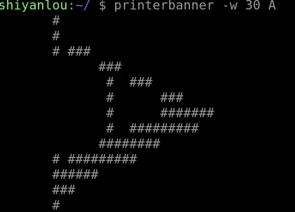
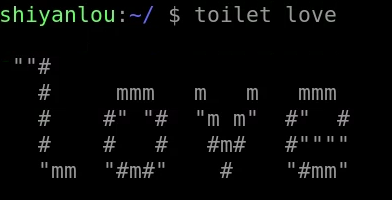
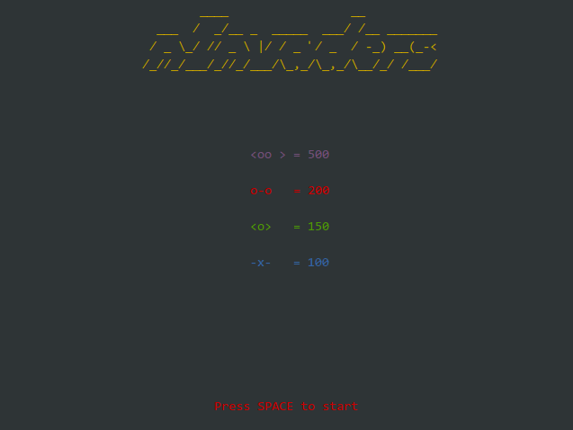

## 输出图形字符的命令
**banner**:
  * 安装: `sudo apt install sysvbanner`
  * eg: `banner linux`
  * 

**printerbanner**:
  * eg: `printerbanner -w 30 A` `-w`指定宽度
  * 

**toilet**:
  * eg: `toilet love`
  * 

**figlet**:
  * eg: `figlet love`
  * 

## 监督你的眼睛
`xeyes`
后台运行: `nohup xeyes &`
只能运行在图形界面

## 数字雨
`cmatrix`

## 跳动的火焰
`aafire`
安装: `sudo apt install libaa-bin`

## 幸运饼干
`fortune`: 打印出一段随机的名言

## 以动物说话形式打印出一段话
`cowsay`
`cowsay -l`: 打印出所有支持的动物种类
`cowsay -f elephant hello world`: `-f`指定动物类型
`fortune | cowsay -f daemon`: 可以与`fortune`命令相结合

## Space Invaders
`ninvaders`

## 彩色的火焰
`cacafire`
安装: `sudo apt install caca-utils`

## bb
`bb`

