## 软件篇

### 终端工具 iTerm2
用于替代Mac原生终端，[官网](https://www.iterm2.com/)，界面漂亮，色彩丰富，可以选择不同的主题。敲命令时，如果命令正确显示绿色，不正确显示红色。
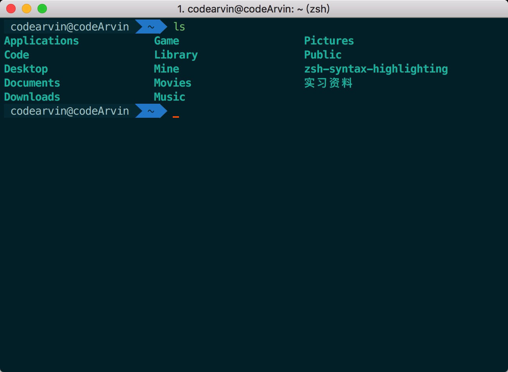

### duet
把你的iPad/iPhone变成一个额外的显示器，[官网](https://www.duetdisplay.com/cn/)。**然而买了之后并没有怎么使用**
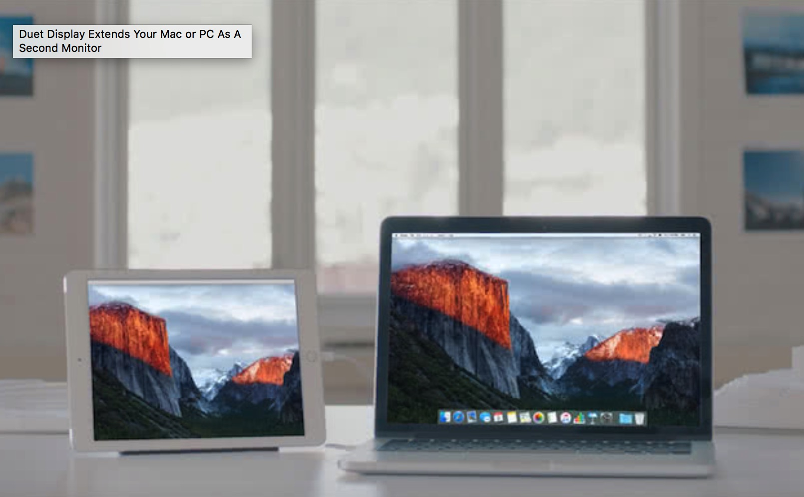

### 网易有道词典
平时查查单词之类的，[官网](http://cidian.youdao.com/multi.html)
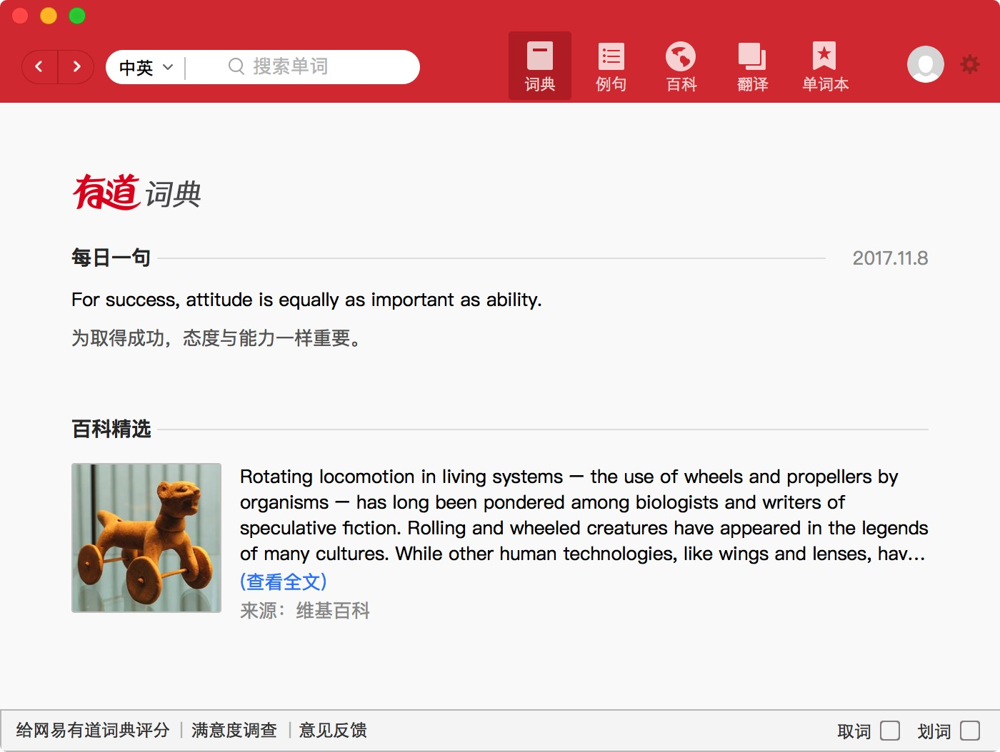

### Geekbench 4
用来测试电脑的性能，[官网](http://www.geekbench.com/)
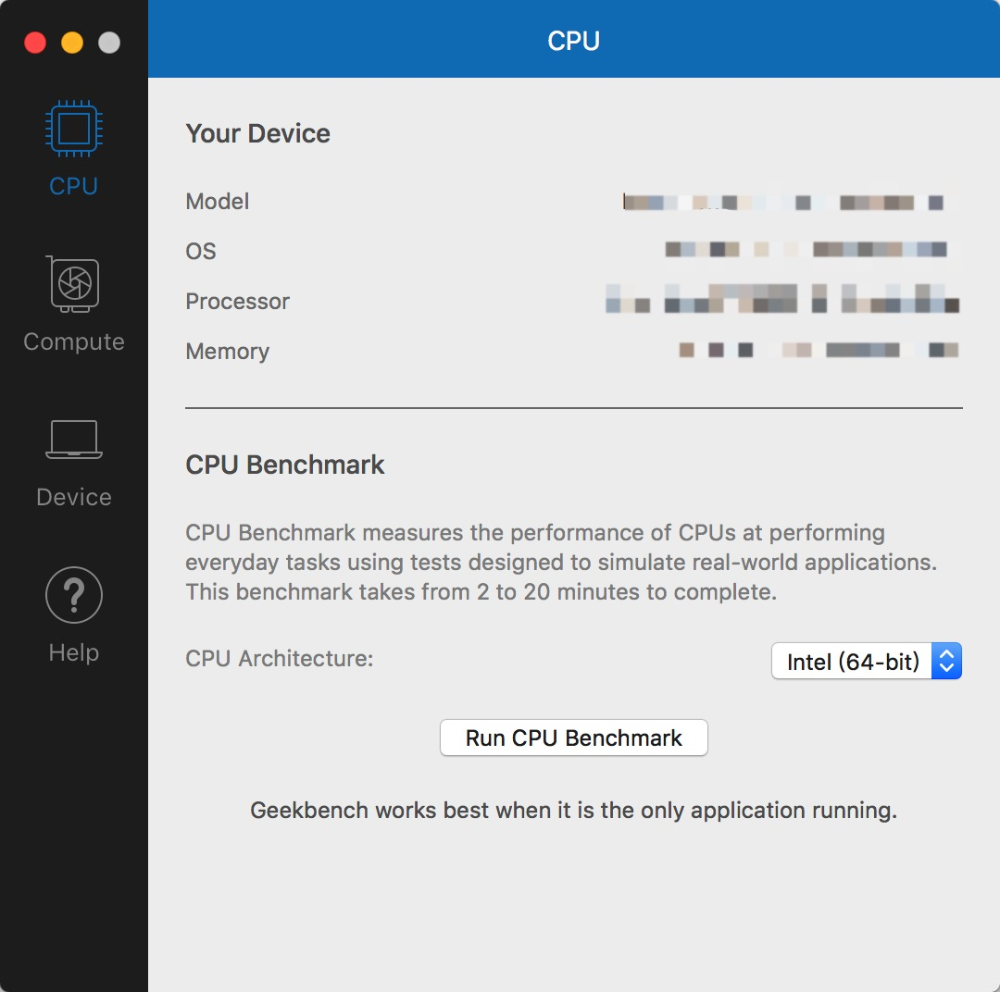

### Blackmagic Disk Speed Test
用来测试你的硬盘速度，[网页](https://itunes.apple.com/us/app/blackmagic-disk-speed-test/id425264550?mt=12)
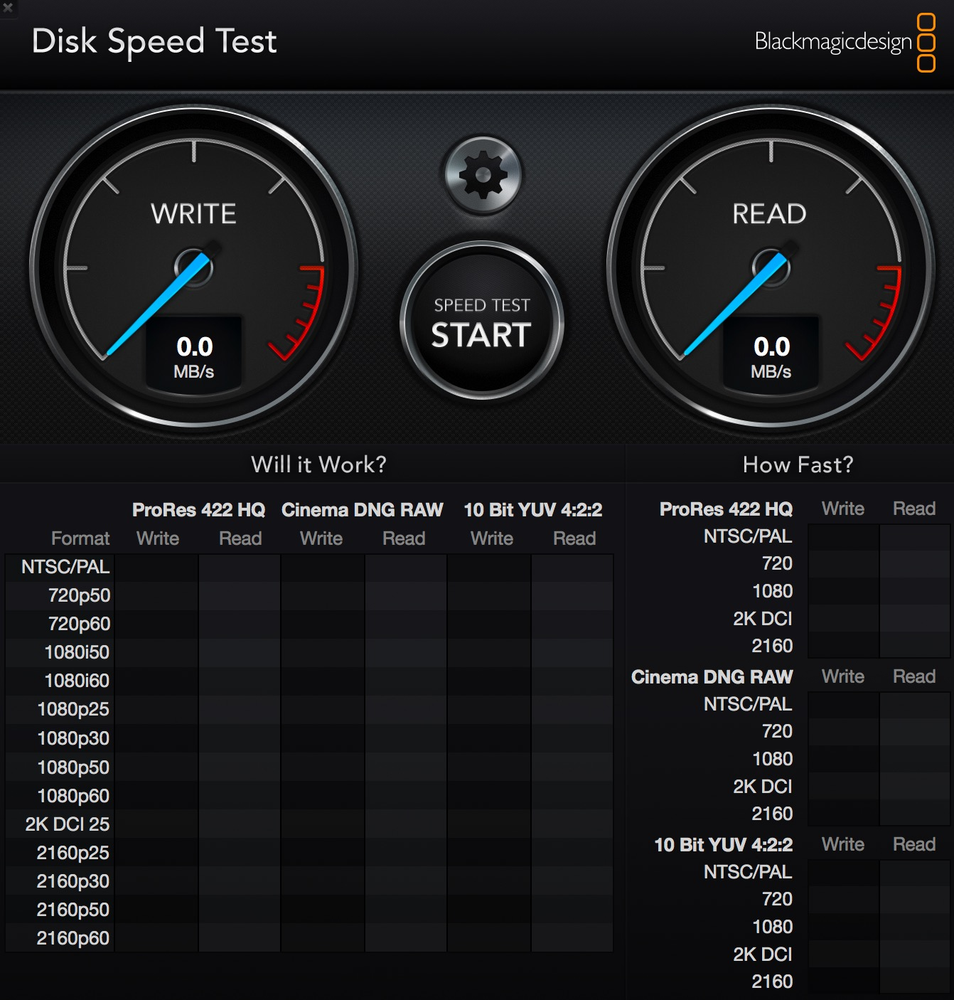

### DaisyDisk
以图形的方式直观的展现你的硬盘使用情况，[官网](https://daisydiskapp.com/)
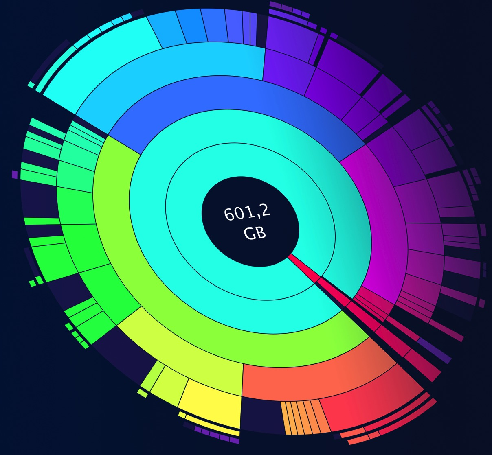

### WebDrop
平时在电脑上看到好的网页突然想在手机上看的时候，如果你用的是Safari，直接可以用AirDrop分享给手机。但Chrome就不可以了，这款软件就是来解决这个痛点的。通过这款软件你可以把当前的Chrome网页经由AirDrop分享出去。[官网](https://github.com/JustinFincher/WebDrop)
*注：但后来我发现了Mac的handoff，Chrome也支持了，只要你的Mac/iPad/iPhone打开蓝牙，当你在某个设备浏览网页的时候，其他设备会有提示按钮，点击就会进入到对应的网页。很是方便。[设置方法](http://www.playpcesor.com/2015/01/handoff-chrome-ios-mac.html)*
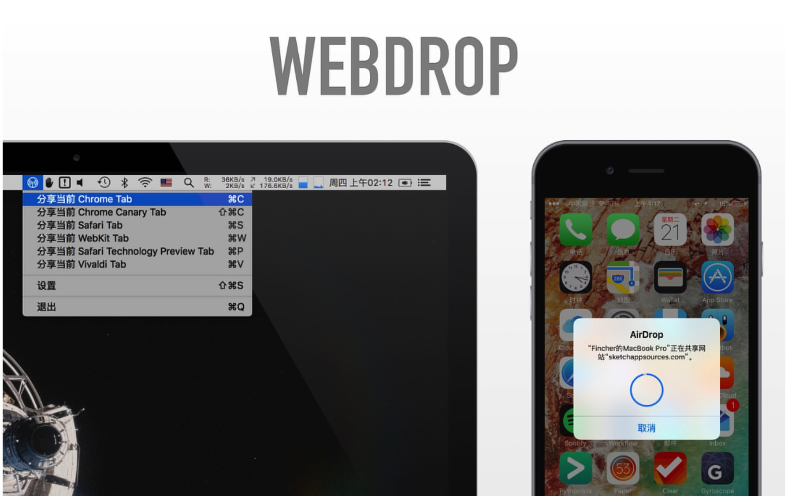

### SizeUp
刚从Window转到Mac时有很多不适应的地方，如果在Window下，鼠标拖动窗口到屏幕边缘，窗口会自动变化大小停靠在上面。而Mac下则不行。SizeUp这款软件就是通过快捷键来将当前窗口固定到屏幕的不同区域。[官网](http://www.irradiatedsoftware.com/sizeup/)
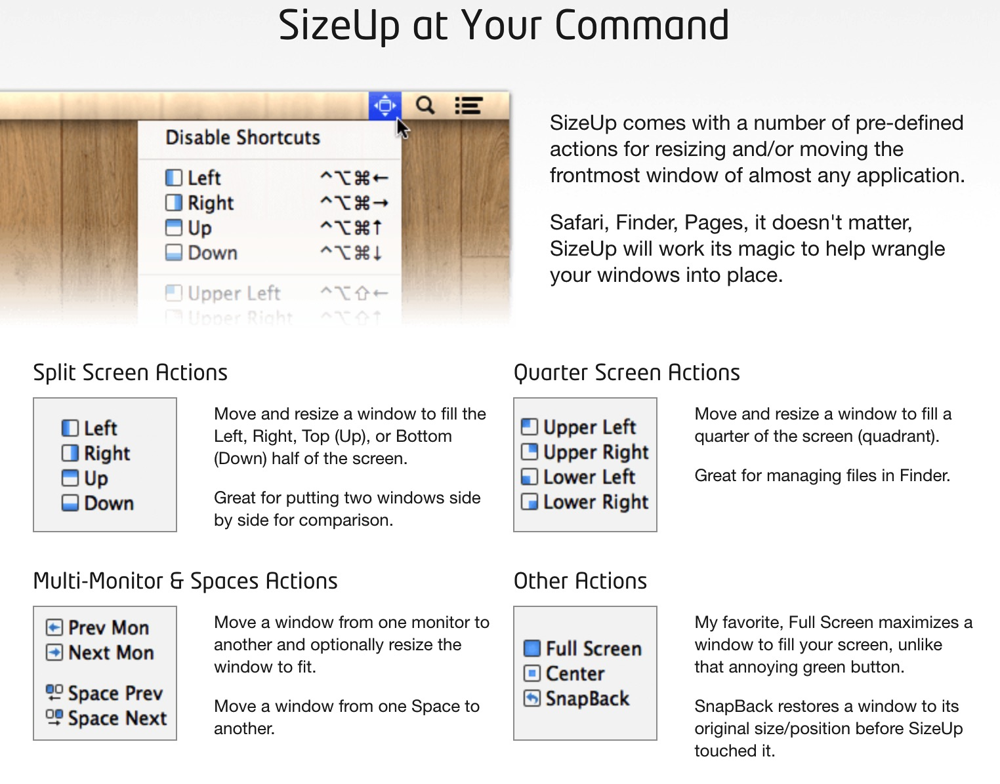

### Pap.er
使用过几款Mac上的壁纸软件，还是这个最吸引我。界面简洁，一目了然，壁纸也都很好看。[官网](http://paper.meiyuan.in/index.html)
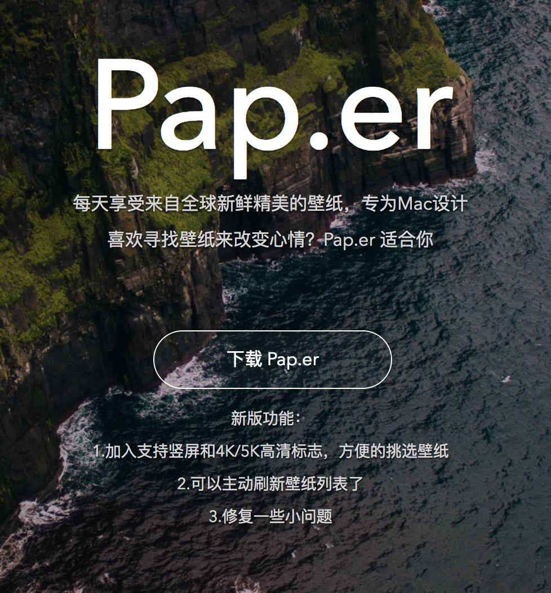

### The Unarchiver
一款Mac上的解压缩软件。简洁不做作,功能强大。[网页](https://itunes.apple.com/cn/app/the-unarchiver/id425424353?mt=12)

### iStat Menus
用来查看你的电脑运行情况，包括CPU、内存、磁盘、网络、传感器、电池、时间、天气等信息，功能十分强大。[官网](https://bjango.com/mac/istatmenus/)
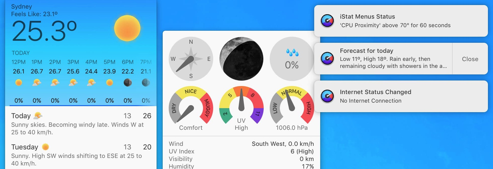
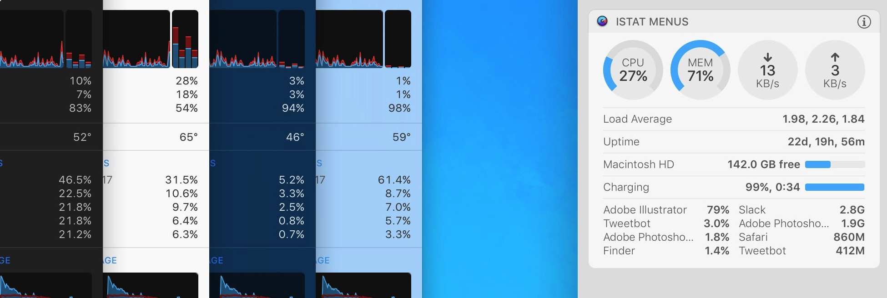

### CheatSheet
长按`⌘`键，就会显示当前软件的快捷键。[官网](https://wwwhttps://atom.io/.mediaatelier.com/CheatSheet/)
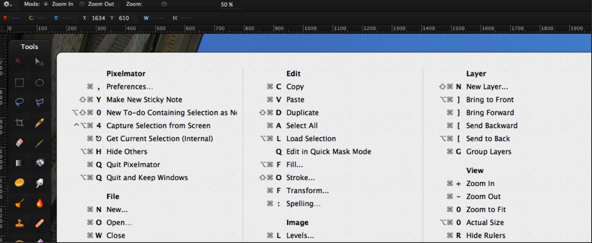

### Copia
一款剪贴板增强软件，感觉还不错。[官网](http://www.dollaropath.com/copia/)

### jietu
鹅厂的一款截图工具，可以在截完后进行简单的操作。[网页](https://itunes.apple.com/cn/app/%E6%88%AA%E5%9B%BE-jietu-%E5%BF%AB%E9%80%9F%E6%A0%87%E6%B3%A8-%E4%BE%BF%E6%8D%B7%E5%88%86%E4%BA%AB%E7%9A%84%E6%88%AA%E5%B1%8F%E5%B7%A5%E5%85%B7/id1059334054?mt=12)

### ShadowSocks
用来科学上网

### Proxifier
让不支持通过代理服务器工作的网络程序能通过HTTPS或SOCKS代理或代理链.[官网](https://www.proxifier.com/)
*注：但Mac终端不能通过这种方法来科学上网，使用`proxychains4`来解决*

### AppCleaner
Mac下卸载软件一般是直接把对应的`app`文件直接移到废纸篓，但这样往往删除的不彻底，通过这款软件可以很好的卸载软件。[官网](https://freemacsoft.net/appcleaner/)
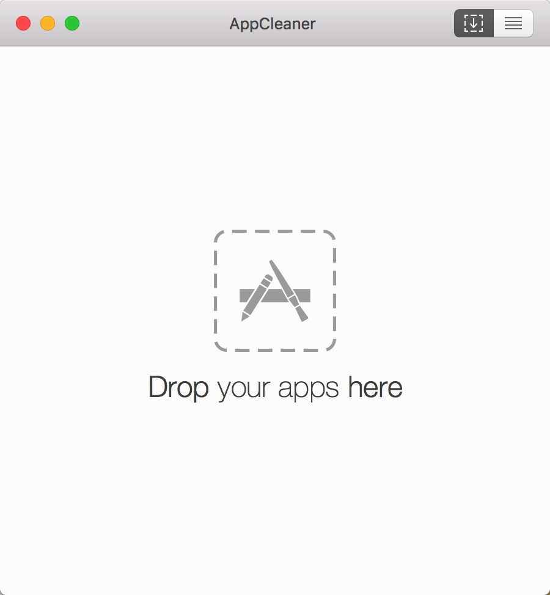

### IINA
Mac上比较好用的一款视频播放器。[官网](https://lhc70000.github.io/iina/)

### Free Download Manager
Mac上一款比较好用的下载工具。在Mac上百度云客户端下载东西会很慢，可以获取下载链接后通过它来下载，下载速度会提升很多。[官网](https://www.freedownloadmanager.org/)
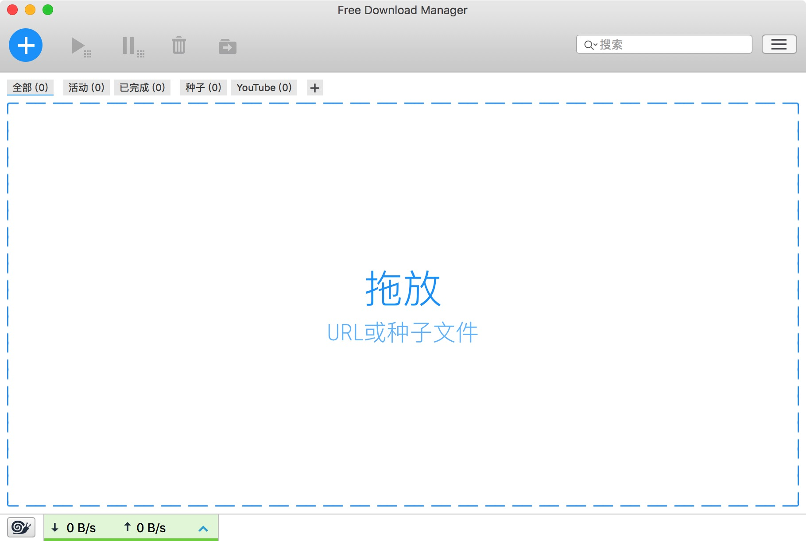

### Air Video HD
让你可以用iPad/iPhone直接看储存在Mac上的视频。[官网](http://www.inmethod.com/airvideohd/index.html;jsessionid=2A117E59F43874E67C37E954AFA8722B)

### Atom
颜值很高的前端编辑器。[官网](https://atom.io/)
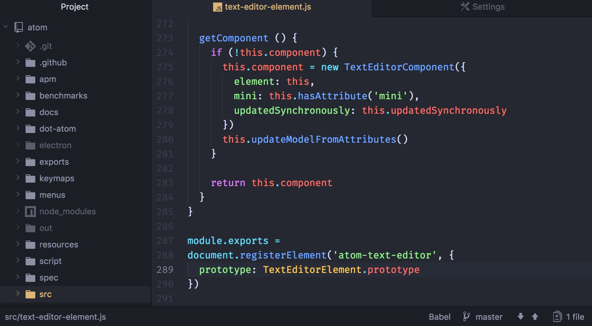

### Flume
一款Instagram的Mac客户端。[官网](https://flumeapp.com/)

### BombSquad
一款很有意思的游戏。可以让你iPhone充当控制器。[网页](https://itunes.apple.com/cn/app/bombsquad/id416482767?mt=12)

### Homebrew
macOS 缺失的软件包管理器。[官网](https://brew.sh/index_zh-cn.html)

### wine
可以在Mac上运行exe文件。但不是全能的。[官网](https://www.winehq.org/)
运行以下命令即可安装
  1. `brew install ruby`
  2. `brew cask install xquartz`
  3. `brew install wine`
  4. `brew install winetricks`
只需要运行`wine 程序名.exe`就可以运行对应的exe程序

## Tips
1. Mac下没有对应的剪切操作。在复制操作`Command-C`后，`Command-V`是复制过去，`Option-Command-V`是剪切过去
2. `Command-Shift-.`是在Finder下显示/隐藏 隐藏文件
3. 用BootCamp在Mac下安装Windows双系统，很方便。**不过升级到10.13后，在window下不能直接从MacOS启动，需要重启按住`option`键来选择启动的系统，还没找到原因**
4. Time Machine备份系统很方便，可以完美的恢复到任何已经备份的时间点上面
5. 终端下用在命令后面加上`&!`来让程序在后台运行且当前终端退出后也不会终止运行
