# Mac下好玩的终端命令

## figlet
`brew install figlet`
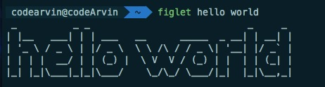

## cowsay
`brew install cowsay`
`cowsay -l`: 查看所有可用动物
`cowsay -f daemon hello world`: 设置显示的动物
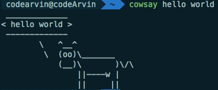

## sl
`brew install sl`
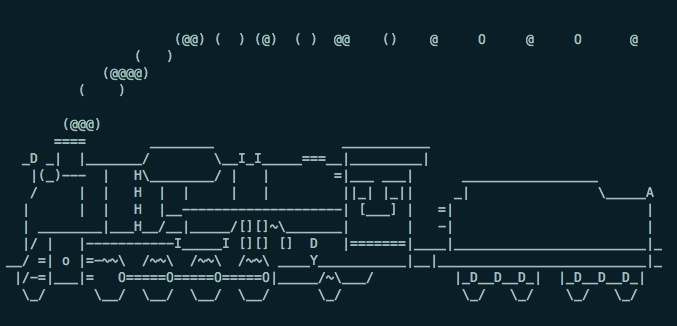

## toilet
`brew install toilet`
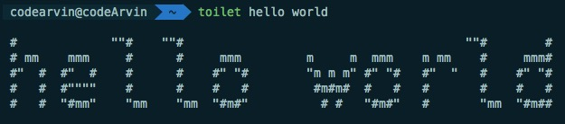

## 2048
`brew install c2048`
`2048 blackwhite`: 黑白风格
`2048 bluered`: 蓝红风格
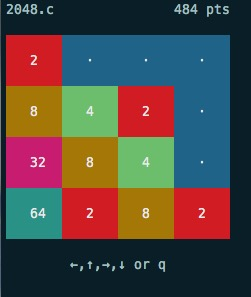

## ninvaders
`brew install ninvaders`
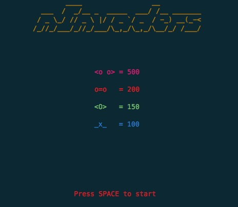

## bastet
`brew install bastet`
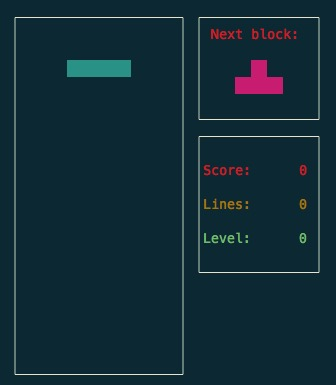

## greed
`brew install greed`
数字表示能吃几个
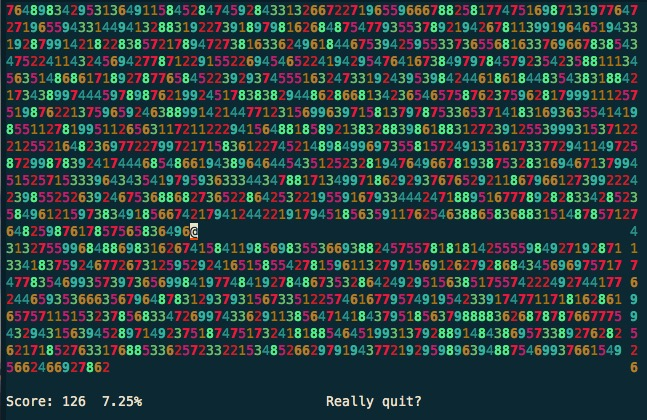

## nsnake
`brew install nsnake`
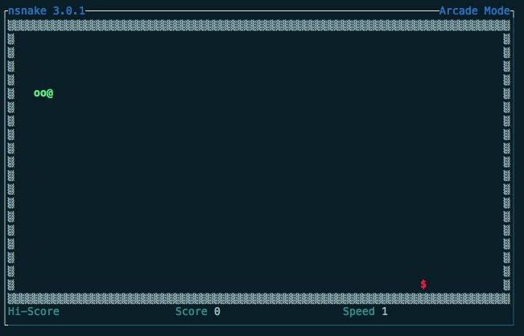

## pacman
`brew install pacman4comsole`
`pacman`

## nethack
`brew install nethack`
文字游戏
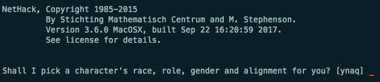

## nudoku
`brew install nudoku`
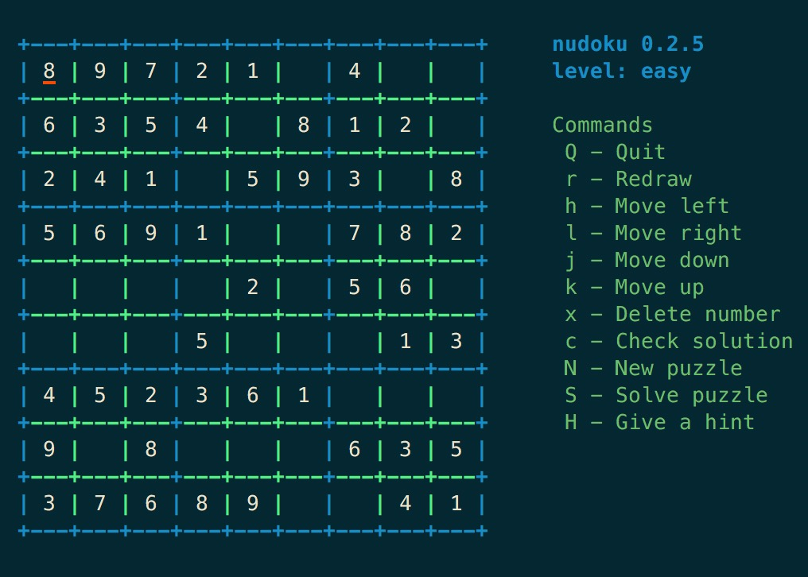

## moon-buggy
`brew install moon-buggy`
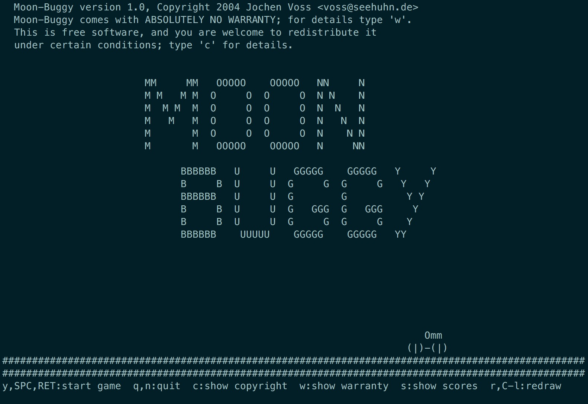
