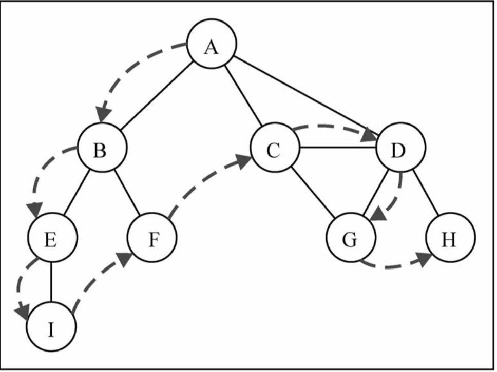

## 基本概念

1. 图是网络结构的抽象模型。图是一组**由边连接的节点(或顶点)**。**任何二元关系**都可以用图来表示。包括社交网络，例如Facebook、Twitter、Google plus等，还可以用图来表示道路、航班以及通信状态

2. 一个图 `G=(V,E)`由以下元素组成
  * `V`: 一组顶点
  * `E`: 一组边，连接`V`中的顶点
3. **相邻顶点**：由一条边连接在一起的顶点
4. **度**：一个顶点相邻顶点的**数量**
5. **路径**：路径是顶点`v1,v2,v3,...,v`k的一个连续序列，其中`vi`和`v(i+1)`是相邻的
6. **简单路径**：简单路径要求不包含重复的顶点
7. **环**：环也是一个简单路径
8. 如果图中不存在环，则称这个图是**无环的**，如果图中每两个顶点间都存在路径，则该图是**连通的**
9. 图可以是无方向的(无向图)或是有方向的(有向图)

10. 如果图中每两个顶点间在双向上都存在路径，则该图是强连通的
11. 图还可以是**未加权的**，或是**加权的**

12. 图可以解决计算机科学中的很多问题，比如
  * 搜索图中的一个特定顶点或搜索一条特定边
  * 寻找图中的一条路径(从一个顶点到另一个顶点)
  * 寻找两个顶点之间的最短路径
  * 环检测
13. 图的表示：从数据结构的角度来说，我们有很多方式来表示图。不存在正确的表达法。图的正确表达法取决于待解决的问题和图的类型
  * **邻接矩阵**：用一个二维数组表示顶点之间的连接
    * 不是强连通的图(**稀疏图**)如果用邻接矩阵来表示，矩阵中会有很多0，会造成储存空间的浪费
    * 图中的顶点数量可能会变，而二维数组不太灵活
    
  * **邻接表**：邻接表由图中每个顶点的相邻顶点列表组成，我们可以用多种数据结构来表示这种数据结构
  
  * **关联矩阵**：用一个二维数组表示边和顶点的关系
  




## 简单代码实现
```javascript
function Graph() {
  // 邻接表表示法
  let vertices = []; // 顶点列表
  let adjLists = new Dictionary(); // 用字典来储存相邻顶点列表
  // white 代表未发现、gray 代表已发现、black 代表已探索
  const initColor = () => {
    let color = [];
    const len = vertices.length;
    for (let i = 0; i < len; i++) {
      color[vertices[i]] = 'white';
    }
    return color;
  }
  // 添加一个顶点
  this.addVertex = (v) => {
    vertices.push(v);
    adjLists.set(v, []);
  }
  // 为已存在的顶点连接一条边
  this.addEdge = (v, w) => {
    if (vertices.indexOf(v) === -1 || vertices.indexOf(w) === -1) {
      return false;
    } else {
      adjLists.get(v).push(w);
      adjLists.get(w).push(v);
    }
  }
  // 以数组的形式初始化顶点列表
  this.initVertex = (arr) => {
    const len = arr.length;
    for (let i = 0; i < len; i++) {
      this.addVertex(arr[i]);
    }
  }
  // 以数组的形式初始化相邻顶点列表
  this.initEdge = (arr) => {
    let len = arr.length;
    for (let i = 0; i < len; i++) {
      this.addEdge(arr[i][0], arr[i][1])
    }
  }
  // 获取顶点列表的数组形式
  this.getVertives = () => vertices
  // 获取相邻顶点列表
  this.getAdjLists = () => adjLists;
  // 以字符串形式输出图的邻接表形式
  this.toString = () => {
    const len = vertices.length;
    let str = '';
    for (let i = 0; i < len; i++) {
      str += `${vertices[i]} --> `;
      let neighbors = adjLists.get(vertices[i]);
      for (let j = 0; j < neighbors.length; j++) {
        str += `${neighbors[j]} `;
      }
      str += '\n';
    }
    return str;
  }
  // Breadth-First Search BFS
  // 广度优先搜索
  // 从指定的第一个顶点开始遍历图，先访问其所有的相邻点，先宽后深的访问顶点
  // 通过将顶点存入队列中，最先入队列的顶点先被探索
  this.bfs = (v, callback) => {
    let queue = new Queue();
    let color = initColor();
    let d = {};
    let pred = {};
    for (let i = 0; i < vertices.length; i++) {
      d[vertices[i]] = 0;
      pred[vertices[i]] = null;
    }
    queue.enqueue(v);
    color[v] = 'gray';
    // 入队列，已发现，变 white
    // 相邻顶点入队列，该点已探索，变 black
    while(!queue.isEmpty()) {
      let u = queue.dequeue();
      let neighbors = adjLists.get(u);
      for (let i = 0; i < neighbors.length; i++) {
        if (color[neighbors[i]] === 'white') {
          queue.enqueue(neighbors[i]);
          color[neighbors[i]] = 'gray';
          d[neighbors[i]] = d[u] + 1;
          pred[neighbors[i]] = u;
        }
      }
      color[u] = 'black';
      if (callback) {
        callback(u)
      }
    }
    return {
      distance: d,
      predecessors: pred,
    };
  }
  // 获取v到其他顶点的最短路径
  this.getShortestPath = (v) => {
    const { distance, predecessors } = this.bfs(v);
    const len = vertices.length;
    const fromVertex = v;
    let paths = '';
    for (let i = 0; i < len; i++) {
      let toVertex = vertices[i];
      let path = new Stack();
      for (let v = toVertex; v !== fromVertex; v = predecessors[v]) {
        path.push(v);
      }
      paths += `${fromVertex}`;
      while (!path.isEmpty()) {
        paths += ` - ${path.pop()}`;
      }
      paths += '\n';
    }
    return paths;
  }
  // Depth-First Search DFS
  // 深度优先搜索
  // 从指定的第一个顶点开始遍历图，沿着路径直到这条路径最后一个顶点。先深后广度的访问顶点
  // 将顶点存入栈中，顶点是沿着路径被探索的，存在新的相邻顶点就去访问
  this.dfs = (callback) => {
    let time = 0;
    let color = initColor();
    let d = {}, f = {}, p = {};
    const len = vertices.length;
    for (let i = 0; i < len; i++) {
      d[vertices[i]] = 0;
      f[vertices[i]] = 0;
      p[vertices[i]] = null;
    }
    const dfsVisit = (v, callback) => {
      console.log('discovered ', v);
      d[v] = ++time;
      color[v] = 'gray';
      if (callback) {
        callback(v);
      }
      let neighbors = adjLists.get(v);
      for (let i = 0; i < neighbors.length; i++) {
        if (color[neighbors[i]] === 'white') {
          p[neighbors[i]] = v;
          dfsVisit(neighbors[i], callback);
        }
      }
      color[v] = 'black';
      f[v] = ++time;
      console.log('explored ', v);
    }
    for (let i = 0; i < len; i++) {
      if (color[vertices[i]] === 'white') {
        dfsVisit(vertices[i], callback);
      }
    }
    return {
      discovery: d,
      finished: f,
      predecessors: p,
    };
  }
  // 获得每个顶点发现和完全探索的时间点 eg: A: discovery_time / finished_time
  this.getDFSTime = () => {
    const { discovery, finished } = this.dfs();
    let time_info = '';
    const len = vertices.length;
    for (let i = 0; i < len; i++) {
      let v = vertices[i];
      time_info += `${v}: ${discovery[v]}/${finished[v]}\n`;
    }
    return time_info;
  }
}
```
