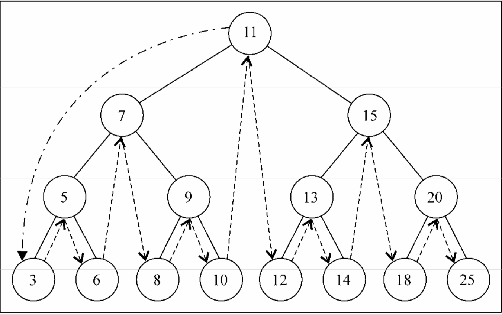
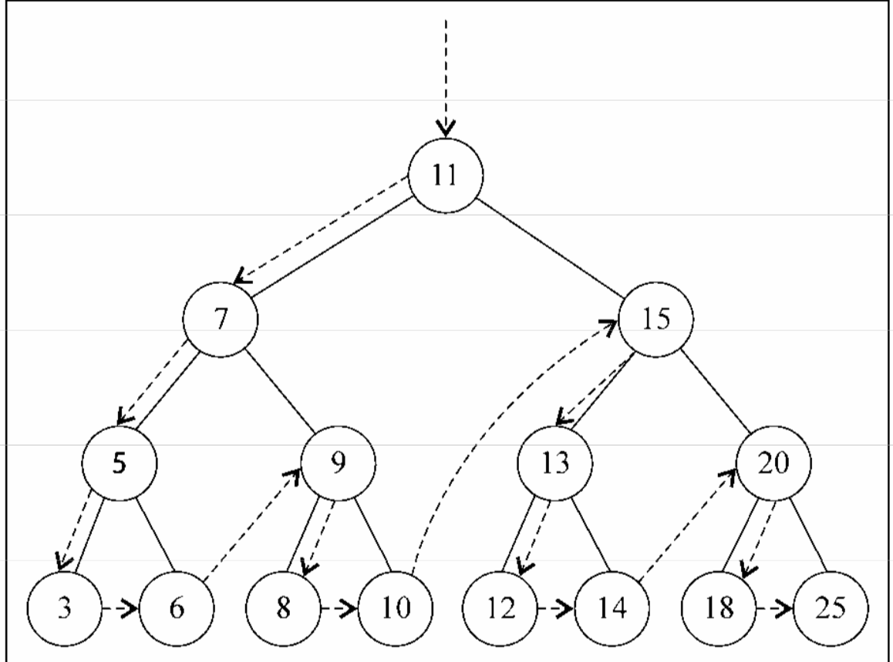
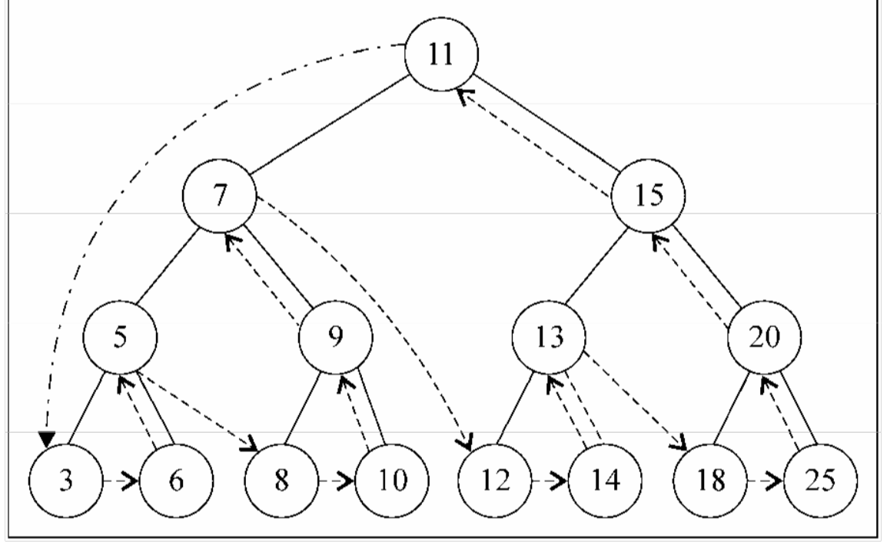

## 概念

1. 树是一种分层数据的抽象模型，现实中最常见的树的例子是家谱或是公司的组织架构图
2. 一个树结构包括一系列存在父子关系的节点，每个节点都有一个父节点以及零个或多个子节点
3. 根节点：位于树顶部的节点
4. 节点：树中的每个元素
  * 内部节点：至少有一个子节点的节点
  * 外部/叶节点：没有子元素的节点
5. 子树：由节点和他的后代构成
6. 深度：取决于它的祖先节点的数量，某节点有几个祖先元素深度就是几
7. 高度：取决于所有节点深度的最大值
8. 二叉树：二叉树中的节点最多只能有两个子节点。这些定义有助于我们写出更高效的向/从树中插入、查找和删除节点的算法
9. 二叉搜索树 Binary-Search Tree(BST): 二叉搜索树要求左侧节点的值小于等于右侧节点的值





## 简单代码实现
```javascript
function BinarySearchTree() {
  let Node = function(key) {
    this.key = key;
    this.left = null;
    this.right = null;
  }
  let root = null;
  // 向树中插入一个新的键
  const insertNode = (node, newNode) => {
    if (newNode.key < node.key) {
      if (node.left === null) {
        node.left = newNode;
      } else {
        insertNode(node.left, newNode);
      }
    } else {
      if (node.right === null) {
        node.right = newNode;
      } else {
        insertNode(node.right, newNode);
      }
    }
  }
  this.insert = key => {
    const newNode = new Node(key);
    if (root === null) {
      root = newNode;
    } else {
      insertNode(root, newNode);
    }
  }
  // 在树中查找一个键，返回一个布尔值
  const searchNode = (node, key) => {
    if (node === null) {
      return false;
    }
    if (key === node.key) {
      return true;
    } else if (key < node.key) {
      return searchNode(node.left, key);
    } else {
      return searchNode(node.right, key);
    }
  }
  this.search = key => {
    searchNode(root, key);
  }
  // 遍历，三种遍历的名称是根据callback调用的位置来命名的
  // 中序遍历：按照从小到大的顺序来遍历节点
  // 中序遍历的一种应用就是对树进行排序操作
  const inOrderTraverseNode = (node, callback) => {
    if (node) {
      inOrderTraverseNode(node.left, callback);
      callback(node);
      inOrderTraverseNode(node.right, callback);
    }
  }
  this.inOrderTraverse = callback => {
    inOrderTraverseNode(root, callback)
  }
  // 先序遍历：先访问节点，再访问其子节点
  // 先序遍历的一种应用是打印一个结构化的文档
  const preOrderTraverseNode = (node, callback) => {
    if (node) {
      callback(node);
      preOrderTraverseNode(node.left, callback);
      preOrderTraverseNode(node.right, callback);
    }
  }
  this.preOrderTraverse = callback => {
    preOrderTraverseNode(root, callback);
  }
  // 后序遍历：先访问节点的子节点，再访问节点本身
  // 后序遍历的一种应用是计算一个目录和其子目录中所有文件所占用空间的大小
  const postOrderTraverseNode = (node, callback) => {
    if (node) {
      postOrderTraverseNode(node.left, callback);
      postOrderTraverseNode(node.right, callback);
      callback(node);
    }
  }
  this.postOrderTraverse = callback => {
    postOrderTraverseNode(root, callback);
  }
  // 对于二叉搜索树来说，最小值和最大值就是最左侧的节点和最右侧的节点
  // 返回树中的最小值
  const minNode = node => {
    if (node) {
      while (node && node.left !== null) {
        node = node.left;
      }
      return node.key;
    }
    return null;
  }
  this.min = () => minNode(root)
  // 返回树中的最大值
  const maxNode = node => {
    if (node) {
      while (node && node.right !== null) {
        node = node.right;
      }
      return node.key;
    }
    return null;
  }
  this.max = () => maxNode(root)
  // 从树中移除某个键
  // 这个函数有两个作用
  // 1. 递归的寻找需要移除的节点
  // 2. 移除需要移除的节点
  const removeNode = (node, key) => {
    if (node) {
      if (node.key === key) {
        // 三种情况
        // 1. 对于叶子节点，直接赋值为null
        // 2. 只有一个左侧或右侧子节点的节点，直接将左/右子节点放到被移除节点的位置
        // 3. 有两个子节点的节点，这种情况比较复杂。先找到右子树的最小值，赋值给被移除节点的位置，然后删除右子树中的最小值
        if (node.left === null && node.right === null) {
          return null;
        } else if (node.left === null && node.right !== null) {
          return node.right;
        } else if (node.left !== null && node.right === null) {
          return node.left;
        } else {
          const min = minNode(node.right);
          node.key = min;
          node.right = removeNode(node.right, min);
          return node;
        }
      } else if (key < node.key) {
        node.left = removeNode(node.left, key);
        return node;
      } else {
        node.right = removeNode(node.right, key);
        return node;
      }
    }
    return null;
  }
  this.remove = key => {
    root = removeNode(root, key);
  }
}
```

## 其他

1. BST存在一个问题，取决于你添加的节点数，树的一条边可能会非常深，这会在某条边上添加、移除和搜索某个节点的时候引起一些性能问题。为了解决这个问题，有一种树叫做`阿德尔森-维尔斯树和兰迪斯树(AVL)`,VAL树是一种自平衡二叉搜索树。意思是任何一个节点左右两侧子树的高度差最多为1，也就是说这种树会在添加或移除节点的时候尽量试着成为一棵完全树
2. 红黑树:可以进行高效的中序遍历
3. 堆积树:
