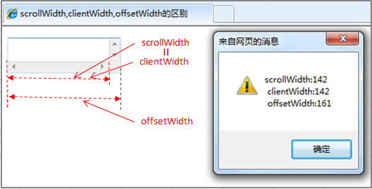
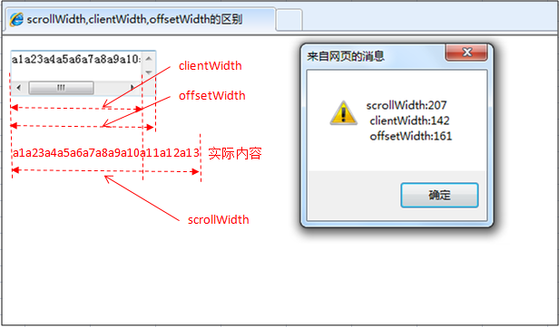

## 属性概念
**这几个概念是在网上不同的文章，文档中找的**
1、`offsetWidth`: 对象整体的实际宽度，包滚动条等边线，会随对象显示大小的变化而改变。
2、`offsetHeight`: 对象整体的实际高度，包滚动条等边线，会随对象显示大小的变化而改变。
3、`offsetLeft`: 元素的左外边框至offsetParent元素的左内边框之间的像素距离
4、`offsetTop`:　元素的上外边框至offsetParent元素的上内边框之间的像素距离
5、`offsetParent`: 与当前元素最近的经过定位(position不等于static)的父级元素

7、`scrollWidth`: 对象的实际内容的宽度，不包边线宽度，会随对象中内容超过可视区后而变大。
8、`scrollHeight`: 对象的实际内容的高度，不包边线宽度，会随对象中内容超过可视区后而变大。
9、`scrollLeft`: 页面利用滚动条滚动到右侧时，隐藏在滚动条左侧的页面的宽度
10、`scrollTop`: 页面利用滚动条滚动到下方时，隐藏在滚动条上方的页面的高度

11、`clientWidth`: 对象内容的可视区的宽度，不包滚动条等边线，会随对象显示大小的变化而改变。
12、`clientHeight`: 对象内容的可视区的高度，不包滚动条等边线，会随对象显示大小的变化而改变。
13、`clientLeft`: 表示一个元素的左边框的宽度，以像素表示。如果元素的文本方向是从右向左（RTL, right-to-left），并且由于内容溢出导致左边出现了一个垂直滚动条，则该属性包括滚动条的宽度。clientLeft 不包括左外边距和左内边距。
14、`clientTop`: 一个元素顶部边框的宽度（以像素表示）。不包括顶部外边距或内边距。

## 我的理解
把这几个属性，分成三部分，结合下面三个图片理解会更好，网上有人说第三个图片不完全正确，我们要辩证的看。
**`body`和其他元素一样，第三个图片中`body`充满整个浏览器，这是需要设置的，不然`body`会像其他元素一样，并不会充满屏幕**(*update at 2017/10/27 20:47:00*)
```css
html, body {
  height: 100%;
}
```
这几个属性可分成三类：offset、client、scroll。把一个网页元素的显示看成是一个相框，中间是玻璃，我们可以看到玻璃后面的内容，相册有边框。而内容则是在玻璃后面的纸，我们可以透过玻璃看到后面纸的内容，纸是可以随意移动的。而对应到这三类就是玻璃区域对应client、整个相框(包括玻璃和边框)对应offset、纸张对应scroll。
这样我们就可以对这几个属性进行理解了。
* `clientWidth`: 玻璃的宽度
* `clientHeight`: 玻璃的高度
* `clientTop`: 玻璃上边缘与相框上边缘的距离，即相框边框的宽度，如果中间有其他的什么东西增加了距离也要算进去
* `clientLeft`: 玻璃左边缘和相框左边缘的距离


* `offsetWidth`: 相框的宽度
* `offsetHeight`: 相框的高度
* `offsetParent`: 相框外面的相框
* `offsetTop`: 相框上边缘与外面相框的玻璃上边缘的距离
* `offsetLeft`: 相册左左边缘与外面相框的玻璃左边缘的距离


* `scrollWidth`: 纸张的宽度
* `scrollHeight`: 纸张的高度
* `scrollTop`: 纸张的上边缘与玻璃的上边缘的距离
* `scrollLeft`: 纸张的左边缘与玻璃的左边缘的距离


**上面几个抽象后的概念要结合着第三幅图片理解，会发现这几个概念其实挺好理解的**

## 图示



